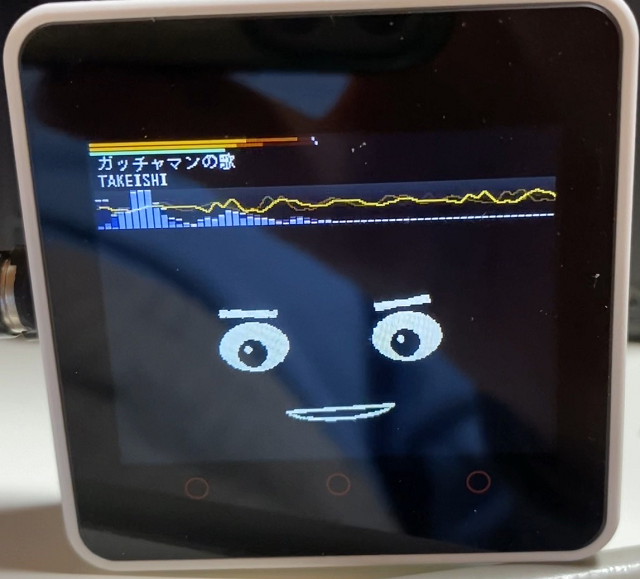

# M5Unified_BTSPK_Avatar
レベルメーター、Avatar表示付きBluetooth Speakerです。

  

レベルメーター表示は、M5UnifiedのサンプルプログラムBluetooth_with_ESP32A2DP"をベースにさせて頂きました。

Avatar表示は、meganetaaanさんのm5stack-avatarをベースにさせていただきました。 
オリジナルはこちら。 
An M5Stack library for rendering avatar faces <https://github.com/meganetaaan/m5stack-avator> 

---
### このプログラムを動かすのに必要な物 ###
* [M5Stack](http://www.m5stack.com/ "Title") (M5Stack Core2で動作確認をしました。) 
* Arduino IDE (バージョン 1.8.15で動作確認をしました。) 
* [M5Unified](https://github.com/m5stack/M5Unified/tree/develop/ "Title")ライブラリ((バージョン 0.0.7で動作確認をしました。)) 
* [M5GFX](https://github.com/m5stack/M5GFX/tree/develop/ "Title")ライブラリ(バージョン 0.0.20で動作確認をしました。) 
* [ESP32-A2DP](https://github.com/pschatzmann/ESP32-A2DP/ "Title")ライブラリ 
  

注意：Arduino IDEでPSRAMをdisableにしてください。 

---

### 使い方 ###
* スマホなどでペアリングを選択すると"esp32"というデバイスが表示されるので選択して接続してください。
  

